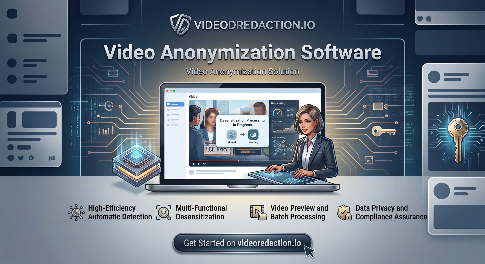
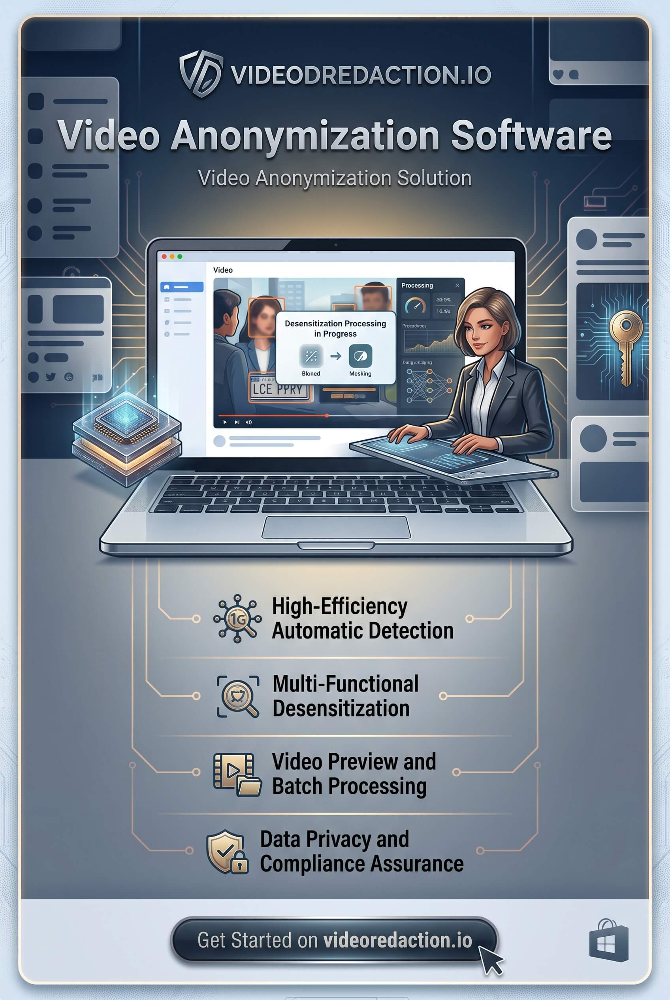
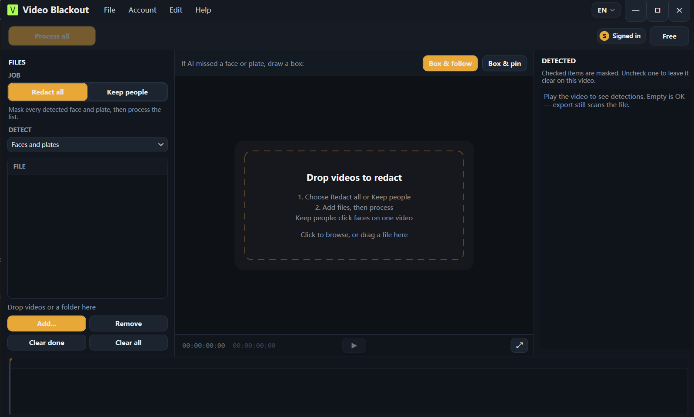
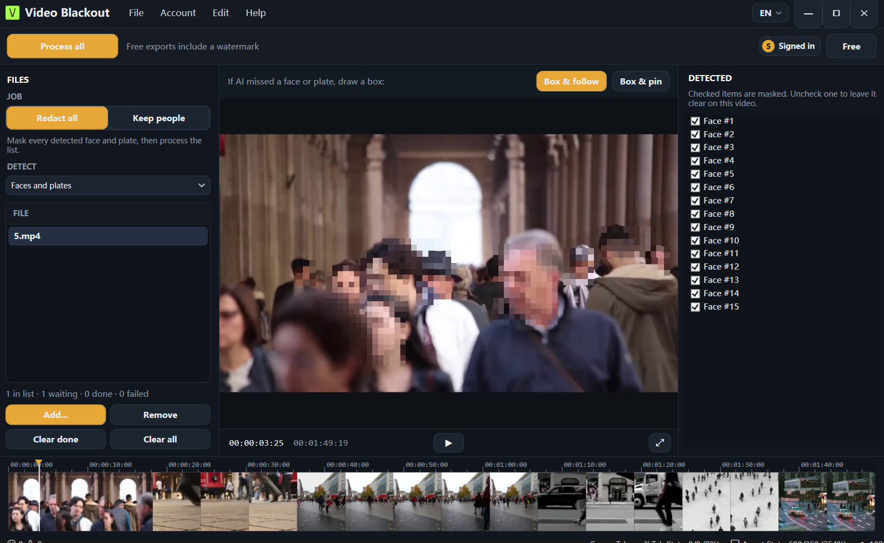

# Video Redaction

Video redaction permanently hides faces, license plates, and other identifiers in a video before that file is shared. [Video Blackout](https://videoredaction.io/en) is Windows software for video redaction. Detection and export run on the PC that opened the file. The original stays untouched, and the footage is not uploaded.

**[Download Video Redaction for Windows](https://videoredaction.io/en/download)**

Install from the website. The download page has the Windows installer and the Microsoft Store listing. Plans and account billing are on the site as well: [videoredaction.io](https://videoredaction.io/en).



## Download and install

| | |
| --- | --- |
| Video Redaction home | [videoredaction.io](https://videoredaction.io/en) |
| Windows download | [Download Video Blackout](https://videoredaction.io/en/download) |
| Plans | [Pricing](https://videoredaction.io/en/pricing) |
| Support | [support@videoredaction.io](mailto:support@videoredaction.io) |

Video Blackout runs on Windows 10 and Windows 11, 64-bit. After you install it, open a video on that computer. A job does not send the source file or the export to videoredaction.io.

Free use processes one video at a time, up to 10 minutes, and the export includes a watermark. Paid plans are managed on the website.

<p align="center">
  
</p>

## What Video Redaction does in this app

Drop a video in, review what was found, then export a new H.264 MP4. Marked pixels are rewritten into that file. A viewer cannot switch the mask off.



- **Faces and plates.** Detect both, or only faces, or only plates. Boxes you did not want can be unchecked for that file.
- **Keep selected people.** Click the faces that should stay clear. Everyone else is masked on export.
- **Missed spots.** Draw a box when detection skips a face, a plate, a screen, or a document.
- **Batch.** Add a folder and process the list.
- **Audio ranges.** Mark a span by hand and mute or beep it. The app does not transcribe speech.



Guides on the website go further into [face redaction](https://videoredaction.io/en/features/face-redaction), [license plate blur](https://videoredaction.io/en/features/license-plate-blur), and [offline video redaction](https://videoredaction.io/en/offline-video-redaction).

## Who uses it

The same local workflow covers disclosure, surveillance review, and privacy requests.

- [Bodycam and law enforcement](https://videoredaction.io/en/use-cases/bodycam-redaction)
- [CCTV for schools, retail, and facilities](https://videoredaction.io/en/use-cases/cctv-redaction)
- [FOIA and public records](https://videoredaction.io/en/use-cases/foia-video-redaction)
- [GDPR and on-premise DSAR work](https://videoredaction.io/en/use-cases/gdpr-video-compliance)

A category overview is on [video redaction software](https://videoredaction.io/en/video-redaction-software).

## Questions

**What is video redaction?**  
Video redaction hides identifying detail in the video file itself. Video Blackout writes that mask into a new MP4. It is not a player overlay.

**Where do I install Video Redaction?**  
Download it from [videoredaction.io/download](https://videoredaction.io/en/download). That page is the install path for Windows.

**Does the video leave this PC?**  
No. Face and plate detection, preview, and export stay on the computer that opened the file. The website is for download, plans, and the account.

## License

Copyright (C) 2026 FlyAllRisk.

Video Blackout is free software under the [GNU Affero General Public License v3.0](legal/AGPL-3.0.txt). You may use, study, modify, and redistribute it under that license. There is no warranty.

This program includes `models/yolo11n-face.onnx`, a face-detection model based on Ultralytics YOLO11 (AGPL-3.0). Because that model is part of the program, Video Blackout as a whole is AGPL-3.0. Notices are in [legal/NOTICE.txt](legal/NOTICE.txt).

This repository is the corresponding source for this version: the application source and the model files that ship with the program, including `yolo11n-face.onnx`. The same source is offered at no charge from [videoredaction.io](https://videoredaction.io/en) and by writing to support@videoredaction.io for at least three years after you receive a given version.

To build the Windows app from this tree, install Visual Studio 2022 with C++ and CMake, plus the .NET 8 SDK. The native project links OpenCV 4.10 and ONNX Runtime from a sibling `app` directory (`../app/opencv` and `../app/third_party/onnxruntime`). From this folder:

```bat
cmake -B build -G "Visual Studio 17 2022" -A x64
cmake --build build --config Release
dotnet build ui\VideoBlackout.Wpf.csproj -c Release
```

The executable is `bin\VideoBlackout.Wpf.exe`. For a normal install, use the [website download](https://videoredaction.io/en/download) instead of building.

## 中文

[Video Blackout](https://videoredaction.io/zh-CN) 是 Windows 上的视频脱敏软件，对应英文检索词 Video Redaction。人脸和车牌在本机检测，漏检的区域可以手动画框。导出的是新的 H.264 MP4，打码写进画面，原片不改，视频不上传。

请到网站下载安装：[videoredaction.io/zh-CN/download](https://videoredaction.io/zh-CN/download)。价格与账号也在网站上。支持邮箱 [support@videoredaction.io](mailto:support@videoredaction.io)。

本仓库是 AGPL-3.0 对应源代码。程序包含基于 Ultralytics YOLO11 的 `models/yolo11n-face.onnx`，因此整体以 AGPL-3.0 发布。可以在该许可证下使用、修改和再分发。没有任何担保。
